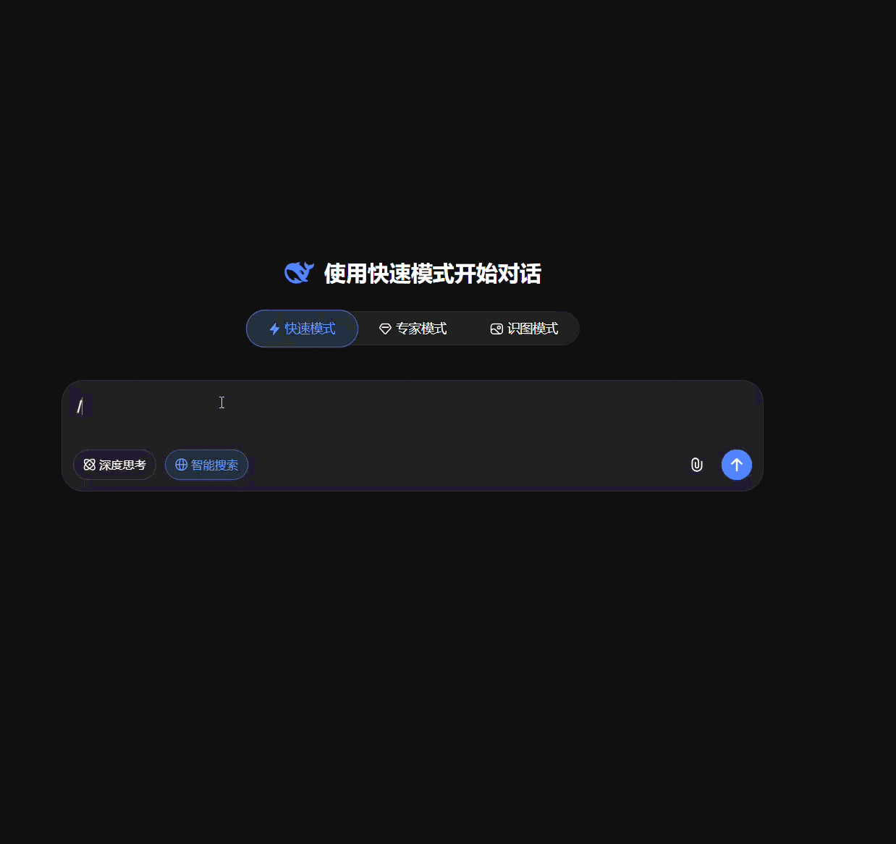

# PromptFlow Chrome Extension

[](https://github.com/axetroy/PromptFlow/actions/workflows/ci.yml)
[](https://github.com/axetroy/PromptFlow/releases)
[](LICENSE)

<p align="center">
    
</p>

---

A browser-level Prompt Command System that provides quick prompt invocation in any input field.

## Features

### 🚀 Quick Prompt Invocation
- Type `/prompts` in any input field to open the prompt panel
- Prompts are inserted directly at your cursor position
- Works with `input`, `textarea`, and `contenteditable` elements

### ⌨️ Keyboard Navigation
- `↑` `↓` - Navigate through prompts
- `Enter` - Select and insert prompt
- `Esc` - Close panel

### 🔍 Smart Search
- Real-time filtering as you type
- Searches title, content, and tags

### 🌐 Multi-language Support
- Automatically detects your browser language
- AI responses will be in your preferred language

### 🎨 Themes
- Supports light and dark themes
- Automatically follows your system preference

### 💾 Data Management
- **Import/Export** - Backup and share your prompts
- **GitHub Sync** - Sync prompts from GitHub repositories
- **CRUD Operations** - Create, edit, and delete custom prompts
- **Default Prompts** - Built-in prompts for common tasks

### 🔒 Privacy & Security
- All data stored locally in your browser
- No external API calls (except GitHub sync)
- Shadow DOM for style isolation

## Default Prompts

| Prompt | Description |
|--------|-------------|
| Code Review | Review code and provide improvement suggestions |
| Explain Code | Get detailed explanation of any code |
| Bug Fix | Debug and fix code issues |
| Write Tests | Generate test cases for code |
| Refactor Code | Improve code structure and quality |
| Analyze Error | Analyze and understand error messages |
| Prompt Generator | Convert a topic into a structured, reusable prompt |

## Installation

### From Source

1. Clone or download this repository
2. Open Chrome and navigate to `chrome://extensions/`
3. Enable "Developer mode" (toggle in top right)
4. Click "Load unpacked"
5. Select the `dist` folder

### From Release

Download the latest release from [Releases](https://github.com/axetroy/PromptFlow/releases) and unzip it.

## Build

```bash
# Install dependencies
npm install

# Build the extension
npm run build
```

This will compile TypeScript files and copy assets to the `dist/` folder.

## Development

```bash
# Install dependencies
npm install

# Type check
npm run typecheck

# Run tests
npm test

# Build for production
npm run build
```

## Usage

1. Navigate to any website with a text input
2. Click on an input field, textarea, or contenteditable element
3. Type `/prompts` to trigger the prompt panel
4. Use arrow keys to navigate or type to search
5. Press Enter to insert the selected prompt
6. Press Escape to close the panel

### Supported Input Types

- Standard `<input>` elements
- `<textarea>` elements
- Contenteditable elements (`<div contenteditable>`, `<p contenteditable>`)
- Works with ChatGPT, Claude, and other AI chat interfaces

### Settings

Click the extension icon in Chrome toolbar, or use the settings button in the prompt panel to:
- Customize the trigger command
- Add/Edit/Delete prompts
- Import/Export prompts
- Sync prompts from GitHub
- Reset to default prompts

### GitHub Sync

Sync prompts from GitHub repositories:

1. Open settings page
2. Click "Sync from GitHub"
3. Enter repository in format `owner/repo`
4. Optionally specify branch and prompts path
5. Prompts are automatically synced

Repository structure requirements:
- Prompt files must be `.md` files
- Each file must have YAML frontmatter with `title` field
- Optional frontmatter: `description`, `tags`

## Project Structure

```
├── .github/
│   └── workflows/
│       └── ci.yml           # GitHub Actions CI/CD
├── src/
│   ├── types/               # TypeScript type definitions
│   │   ├── prompt.ts        # Prompt type definitions
│   │   └── sync.ts          # GitHub sync types
│   ├── utils/               # Storage and utility functions
│   ├── prompts/             # Default prompt templates
│   ├── SettingsApp.tsx      # Settings page React app
│   ├── SyncManager.tsx      # GitHub sync manager component
│   ├── content.ts           # Content script (input detection, panel)
│   ├── background.ts        # Service worker (data management)
│   ├── cursor-utils.ts      # Cursor position utilities
│   └── panel.css            # Panel styles
├── scripts/
│   ├── build.js             # esbuild bundler script
│   ├── copy-assets.js       # Asset copy script
│   └── generate-icons.js    # Icon generation script
├── tests/                   # Playwright integration tests
├── icons/                   # Extension icons
├── .npmrc                   # npm configuration (Playwright mirror)
├── playwright.config.ts     # Playwright configuration
├── tsconfig.json            # TypeScript configuration
└── package.json             # Project dependencies
```

## Architecture

```
┌─────────────────────────────────┐
│       Chrome Extension          │
├─────────────────────────────────┤
│ Content Script                  │
│  - Input monitoring             │
│  - Trigger detection            │
│  - Cursor management            │
│  - Text insertion               │
├─────────────────────────────────┤
│ UI Layer (Floating Panel)       │
│  - Shadow DOM isolation         │
│  - Search filtering             │
│  - Keyboard navigation          │
├─────────────────────────────────┤
│ Background Service Worker       │
│  - Data management              │
│  - Storage sync                 │
│  - GitHub integration           │
├─────────────────────────────────┤
│ Storage Layer                   │
│  - chrome.storage.local        │
│  - Import/Export support       │
└─────────────────────────────────┘
```

## CI/CD

This project uses GitHub Actions for continuous integration:

- **Test**: Runs type checks, build, and Playwright tests
- **Release**: Creates zip archive on version tags

## License

MIT
